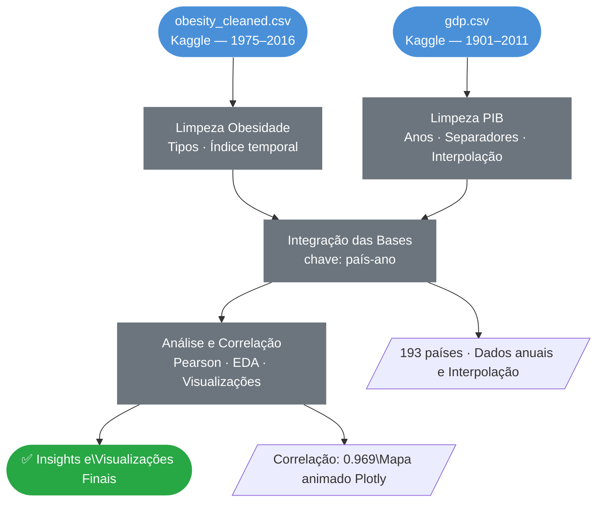
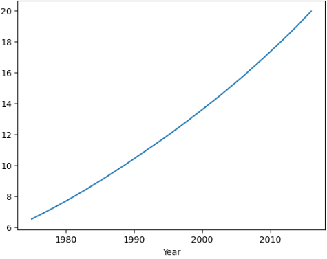
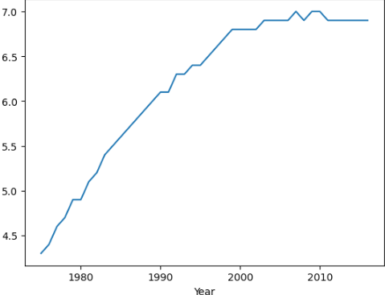
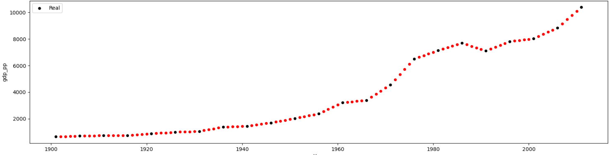

<div align="center">

# Obesidade e PIB Per Capita — Análise de Correlação
### EDA · Correlação de Pearson · Visualização Interativa · Análise Global

<br>

[](https://www.python.org/)
[](https://pandas.pydata.org/)
[](https://plotly.com/)
[](https://numpy.org/)
[]()

<br>

> Investigação estatística sobre a relação entre crescimento econômico e obesidade em 193 países,
> cobrindo um período de mais de um século de dados (1901–2016).

</div>

---

## Índice

- [Contexto](#contexto)
- [Objetivos](#objetivos)
- [Pipeline do Projeto](#pipeline-do-projeto)
- [Tecnologias](#tecnologias-utilizadas)
- [Fontes de Dados](#fontes-de-dados)
- [Etapas Detalhadas](#etapas-detalhadas)
- [Principais Resultados](#principais-resultados)
- [Estrutura do Repositório](#estrutura-do-repositório)
- [Autor](#autor)

---

## Contexto

Este projeto investiga **se existe correlação entre o crescimento econômico e os índices de obesidade** em diferentes países ao longo das últimas décadas. A análise combina dois datasets públicos do Kaggle cobrindo períodos históricos distintos, exigindo técnicas de integração, interpolação e análise estatística para torná-los comparáveis.

| Dimensão de Análise | Abordagem |
|---|---|
| **Temporal** | Evolução de 1975 a 2016 |
| **Geográfica** | 193 países em 8 regiões do mundo |
| **Demográfica** | Comparação entre gêneros |
| **Estatística** | Correlação de Pearson entre PIB e obesidade |

---

## Objetivos

- Investigar a relação entre crescimento econômico e evolução da obesidade globalmente
- Identificar países e regiões com maior e menor crescimento da obesidade no período
- Analisar diferenças entre gêneros nos índices de obesidade
- Quantificar a correlação entre PIB per capita e taxa de obesidade via coeficiente de Pearson
- Criar visualizações interativas (mapa animado) para comunicar tendências globais

---

## Pipeline do Projeto



---

## Tecnologias Utilizadas

| Tecnologia | Uso no Projeto |
|---|---|
|  | Linguagem principal |
|  | Limpeza, manipulação e integração dos dados |
|  | Interpolação linear e cálculos estatísticos |
|  | Visualizações estáticas e séries temporais |
|  | Mapa coroplético animado interativo |

---

## Fontes de Dados

| Dataset | Fonte | Período | Cobertura |
|---|---|---|---|
| [Obesity among adults by country](https://www.kaggle.com/amanarora/obesity-among-adults-by-country-19752016/) | Kaggle | 1975–2016 | Global · por gênero |
| [GDP Per Person](https://www.kaggle.com/divyansh22/gdp-per-person-19012011) | Kaggle | 1901–2011 | 193 países · 8 regiões |

---

## Etapas Detalhadas

**Limpeza e Estruturação — Obesidade**

- Remoção de colunas redundantes (`Unnamed: 0`)
- Extração do valor numérico da coluna `Obesity (%)` via `.apply()` e `.split()`
- Conversão para `float64` e definição do índice temporal por ano
- Separação por gênero: `Female`, `Male`, `Both sexes`

**Limpeza e Estruturação — PIB**

- Conversão do campo `Year` de formato data para inteiro
- Limpeza do campo `gdp_pp`: remoção de espaços e separadores de milhar via `.replace(",")`
- Identificação de lacunas temporais: dados originais em intervalos de 5 anos
- **Interpolação linear** para preencher os anos ausentes entre cada par de registros reais por país
- Dataset expandido para registros anuais completos por país

**Integração das Bases**

- Criação de chave composta `país-ano` em ambos os DataFrames
- Mapeamento de obesidade para o DataFrame de PIB via `.map()`
- Remoção de registros sem correspondência (`dropna()`)

**Análise e Correlação**

- Cálculo da **Correlação de Pearson** entre médias anuais globais de PIB e obesidade
- Análise de evolução da obesidade por país (1975 vs. 2016)
- Comparação por gênero para o Brasil
- Ranking de crescimento do PIB por região (1901–1996)
- Mapa coroplético animado com Plotly Express

---

## Principais Resultados

### Correlação Global entre PIB e Obesidade

> **Coeficiente de Pearson: 0.9694** — correlação positiva extremamente forte

Isso significa que, em escala global, à medida que a média do PIB per capita cresce ao longo dos anos, a taxa de obesidade acompanha esse crescimento de forma consistente, com quase 97% de covariação entre as variáveis.

---

### Evolução Global da Obesidade (1975–2016)



> Crescimento contínuo sem períodos de reversão. A média global de obesidade em 2015 foi de **19,5%** para ambos os sexos.

---

### Diferença de Obesidade entre Gêneros — Brasil



> No Brasil, mulheres consistentemente apresentam maior taxa de obesidade que homens ao longo de todo o período analisado.

| Gênero | Média de Obesidade (2015) |
|---|---|
| Feminino | **22,9%** |
| Ambos os sexos | 19,5% |
| Masculino | 16,0% |

---

### PIB Per Capita do Brasil — Série com Interpolação



> Linha contínua gerada pela interpolação linear dos anos ausentes nos dados originais. Os pontos reais estão destacados em azul, os interpolados em laranja.

---

### Países com Maior Crescimento de Obesidade (1975–2016)

| Ranking | País | Aumento (p.p.) |
|---|---|---|
| 🥇 | Tuvalu | +33,7 |
| 🥈 | Niue | +31,1 |
| 🥉 | Kiribati | +30,1 |
| 4º | Tonga | +28,3 |
| 5º | Cook Islands | +27,9 |

> Todos os 5 países com maior crescimento de obesidade são ilhas do Pacífico — padrão que sugere transformação acelerada do estilo de vida e alimentação nessas regiões.

### Países com Menor Crescimento de Obesidade (1975–2016)

| Ranking | País | Aumento (p.p.) |
|---|---|---|
| 1º | Viet Nam | +2,0 |
| 2º | Singapura | +3,1 |
| 3º | Japão | +3,3 |
| 4º | Bangladesh | +3,4 |
| 5º | Timor-Leste | +3,6 |

### País com Maior Índice de Obesidade em 2015

> **Nauru — 63,1%** de prevalência de obesidade em mulheres

### Crescimento do PIB Per Capita por Região (1901–1996)

| Região | Crescimento (%) |
|---|---|
| Sub-Saharan Africa | 249% |
| South America | 312% |
| Australia and Oceania | 396% |
| Central America and the Caribbean | 406% |
| North America | 590% |
| Europe | 594% |
| Asia | 712% |
| **Middle East, North Africa & Greater Arabia** | **857%** |

### Conclusão

O estudo demonstra que a evolução econômica tende a acompanhar o aumento das taxas de obesidade — o crescimento do PIB, por si só, não implica melhora de qualidade de vida. Essa relação reforça a importância de políticas públicas voltadas à educação alimentar e ao acesso equilibrado à nutrição, especialmente em países em desenvolvimento.

### Próximos Passos Sugeridos

- Análise de causalidade (Granger) para verificar se o PIB *precede* o crescimento da obesidade
- Inclusão de variável de urbanização para controle do modelo
- Segmentação por faixa de renda (Banco Mundial) para comparação intragrupo
- Modelo de regressão multivariada com PIB, urbanização e região como preditores

---

## Estrutura do Repositório

```
Obesidade_e_PIB_per_capita/
│
├── 📁 Datasets/
│   ├── obesity_cleaned.csv       # Base de obesidade por país e gênero (1975–2016)
│   └── gdp.csv                   # Base de PIB per capita por país (1901–2011)
│
├── 📁 assets/                    # Gráficos gerados na análise
│   ├── diferenca_obesidade_genero_Brasil.png
│   ├── evolucao_global_obesidade.png
│   └── pib_Brasil_interpolacao.png
│
├── 📓 Analise_de_correlacao_PIB_e_obesidade.ipynb   # Notebook completo
├── 📄 requirements.txt                              # Dependências do projeto
└── 📄 README.md                                     # Documentação do projeto
```

---

## Autor

<div align="center">


**Anderson Coelho**
*Cientista de Dados*

[](https://www.linkedin.com/in/anderson-coelho-42671634a/)
[](https://github.com/Anderson1999DC)

</div>

---

<div align="center">

</div>
